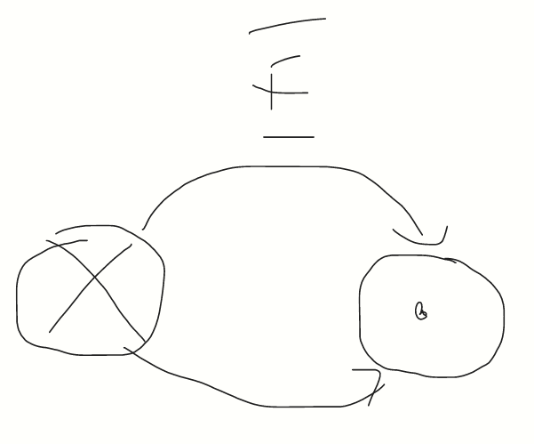
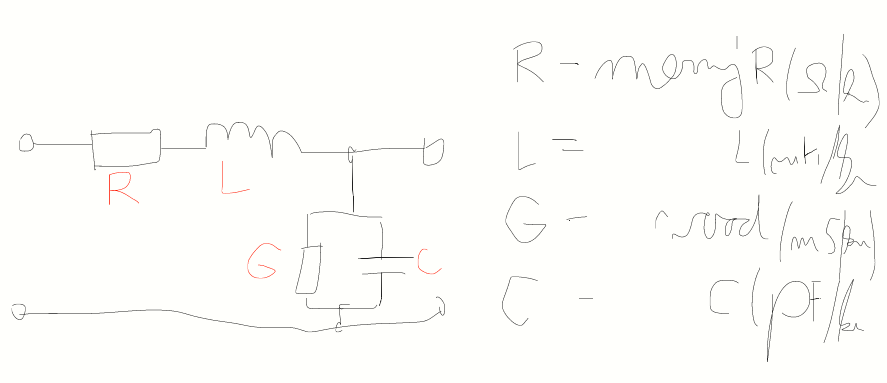

# Prenos signálu

- metalický
  - homogénny
    - symetrické
    - nesymetrické
  - nehomogénny
- optický
- elektromagnetický

**Magnetické pole je vždy uzavreté.**

## Dvojlinka

- dvojlinka je tiež kábel

- Na homogénne vedenie musí byť frekvencia > 60kHz

- Tvoríme náhradné schémy.

## Primárne parametre

- smer
- čím vyššia f, tým je fáza bližšie k 0
  
  ### Impedancia
- **Z** - vlnová (charakteristická impedancia)

Z = √R + ( j * omega * L) / G + ( j * omega * c )

## Relatívna permitivita

- hovorí, koľkonásobne bude elektrické pole znížené

## Relatívna permeabilita

- hovorí, koľkonásobne bude pole zvýšené

## Činiteľ skrátenia

- Vlnová dĺžka sa po budení bude skracovať v závislosti od materiálu.
- rýchlosť šírenia elektromagnetickej vlny vo vzduchu vydelené frekvenciou
