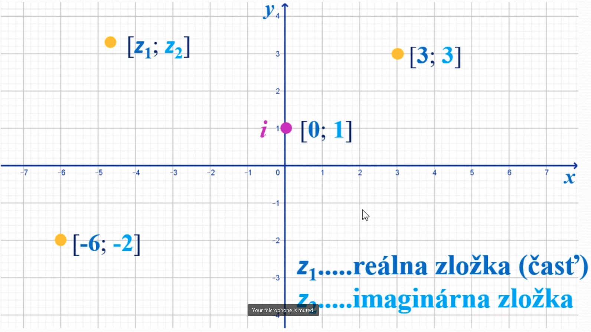
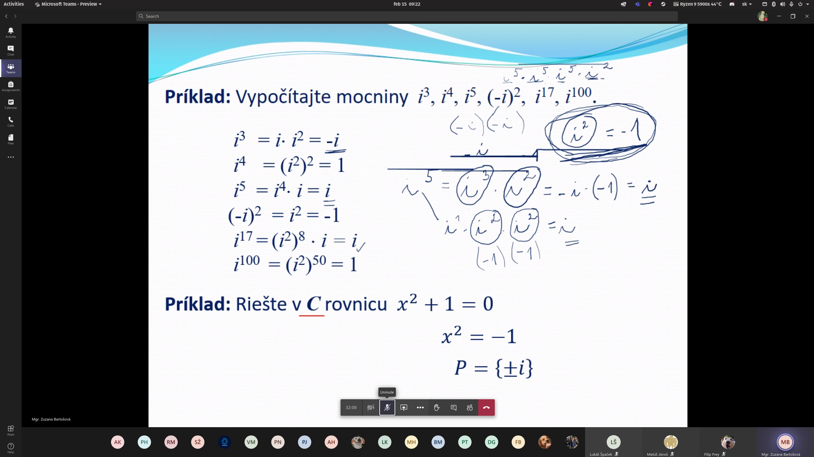
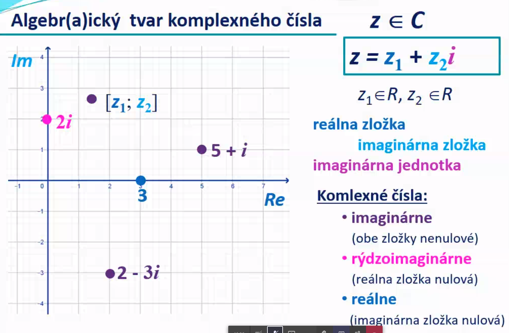

# Komplexné čísla

- Množina komplexných čísle - C

- Zavedenie (Leo Euler) čísla **i**(imaginárna jednotka) - i = sqrt(-1)

## Typy

### Imaginárne

Obe zložky nenulové.

### Rýdzoimaginárne

Reálna zložka nulová.

### Reálne

Imaginárna zložka nulová.

#### Príklad

Vypočítajte mocniny: i^3, i^3, i^5, (-i)^2, i^17, i^100

i^3 = i * i^2 = -i

i^4 = (i^2)^2 = 1

i^5 = (i^4) * i = i

(-i)^2 = i^2 = -1

i^17 = (i^2)^8 * i = i

i^100 = (i^2)^50 = 1

#### Príklad

Riešte v C

x^2 + 1 = 0

x^2 = -1

P = {+-i}

## Zobrazenie komplexných čísel

### V Gausovej rovine

### Vo vektoroch

### Algebraiciky

## Komplexne združené čísla

Z = Z1 + Z2i => Z = Z1 - Z2i

Z = 3 + i

## Opačné čísla k číslu

Z = Z1 + Z2i => -Z = - Z1 - Z2i

Z = 3 + i

-Z = -3 - i

## Rovnosť komplexných čísel

Dve komplexné čísla sa rovnajú práve vtedy, keď sa rovnajú ich reálne aj miaginárne zložky.

a = b <=> a1 = b1 /\ a2 = b2

## Súčet komplexných čísel

Reálna časť súčtu sa rovná súčtu reálnych častí a imaginárna časť súčtu sa rova súčtu imaginárnych častí.

a + b = (a1 + b1) + (a2 + b2)i

3 + i + 2 + i = 5 + 4i

## Rozdiel komplexných čísel

Reálna časť rozdielu sa rovná rozdielu reálnych častí a imaginárna časť rozdielu sa rova rozdielu imaginárnych častí.

a - b = a + (-b) = (a1 - b1) + (a2 - b2)i

5 + 2i - (2 + 3i) = 3 - i

## Súčin komplexných čísel

Násobia sa všetky zložky medzi sebou.

a * b = (a1b1 - a2b2) + (a1b2 + a2b1)i

(2 + 3i) * (1 + i) = 2 + 2i + 3i + 3i^2 = 2 + 2i + 3i + 3 * (- 1)

