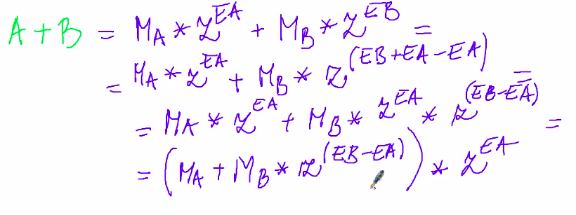
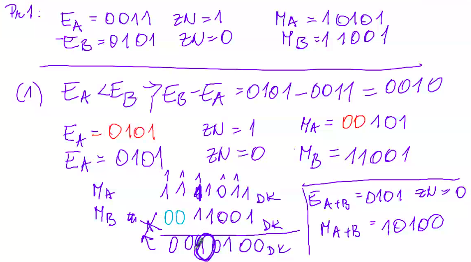

# Pohyblivá rádová čiarka

Floaty majú väčší rozsah zobrazitelných hodnôt, ale majú menšiu rozlišovaciu schoposť (presnosť).

## Operácie sčítania, odčítania, násobenia a delenia v pohyblivej rádovej čiarke

### Sčítanie

Operácia sčítania je možná, ak majú rovnaký exponent.

### Odčítanie

